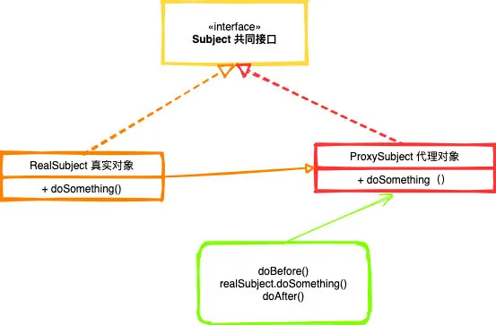
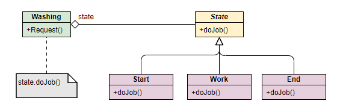
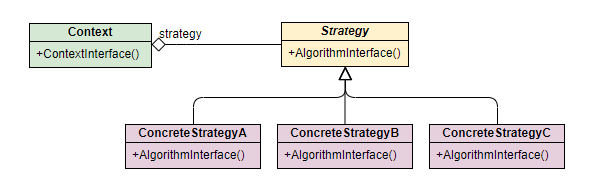

设计模式分为三大类，共23种

创建型模式：
    单例模式
        懒汉式
        饿汉式
        双重检查锁式
        内部静态类式
        enum枚举式
        参考：https://mp.weixin.qq.com/s/dW0L-PoBeTFHhD29HJO0BQ
    抽象工厂模式
    原型模式
    建造者模式
    工厂模式
        静态工厂
        工厂方法
        抽象工厂
        参考：
        https://aobing.blog.csdn.net/article/details/115877456
        https://www.cnblogs.com/yssjun/p/11102162.html

结构型模式：
    适配器模式
    桥接模式
    装饰模式
    组合模式
    外观模式
    享元模式
    代理模式
    
行为型模式：
    模版方法模式
    命令模式
    访问者模式
    迭代器模式
    观察者模式
    中介者模式
    备忘录模式
    解释器模式（Interpreter模式）
    状态模式
    
    策略模式
    
    职责链模式(责任链模式)

